# TP CI/CD - API Node.js + MongoDB

## 1. Contexte
Ce projet met en place une chaine complete de conteneurisation et de déploiement pour une application composée de deux services:
- une API Node.js (Express)
- une base de donnees MongoDB

Objectif: automatiser les tests, la construction d'image et le déploiement sur une VM Azure avec Kubernetes.

## 2. Architecture
- Service API: [api/src/index.js](api/src/index.js)
- Service DB: MongoDB
- Orchestration locale: [docker-compose.yml](docker-compose.yml)
- Orchestration Kubernetes: [k8s/db-deployment.yaml](k8s/db-deployment.yaml), [k8s/api-deployment.yaml](k8s/api-deployment.yaml)
- Pipeline CI/CD: [.github/workflows/ci-cd.yml](.github/workflows/pipeline.yml)

## 3. Exigences TP 
- Deux services distincts: API + DB
- Endpoint de santé: GET /health
- Communication inter-services: API connectée a Mongo via variables d'environnement
- Dockerfile pour chaque service:
  - [api/Dockerfile](api/Dockerfile)
  - [db/Dockerfile](db/Dockerfile)
- Docker Compose opérationnel
- Kubernetes opérationnel sur VM
- Variables et secrets géres
- Pipeline automatique GitHub Actions

## 4. Lancement local
### 4.1 Prérequis
- Docker Desktop
- Docker Compose

### 4.2 Configuration local
1. Copier [\.env.example](.env.example) vers .env
2. Renseigner DB_PASSWORD dans .env

### 4.3 Demarrage local
```bash
docker compose up --build
```

### 4.4 Tests locaux
```bash
curl.exe http://localhost:3000/health
curl.exe -X POST http://localhost:3000/users -H "Content-Type: application/json" -d "{\"name\":\"Testeur\",\"email\":\"testeur@test.com\"}"
curl.exe http://localhost:3000/users
```

Attendus:
- /health retourne status ok
- POST /users crée un document
- GET /users retourne la liste

## 5. Deploiement Kubernetes sur VM Azure
### 5.1 Prerequis VM
- Docker installé
- Kubernetes local (K3s ou Minikube) installé
- kubectl fonctionnel
- Port 30080 ouvert dans le NSG Azure

### 5.2 Deploiement
```bash
kubectl apply -f k8s/db-deployment.yaml
kubectl -n app create secret generic db-secret --from-literal=DB_PASSWORD='VOTRE_MOT_DE_PASSE' --dry-run=client -o yaml | kubectl apply -f -
kubectl apply -f k8s/api-deployment.yaml
```

### 5.3 Verification
```bash
kubectl get pods -n app
kubectl get svc -n app
curl http://IP_VM:30080/health
```

## 6. Pipeline CI/CD
Le workflow est dans [.github/workflows/ci-cd.yml](.github/workflows/pipeline.yml).

Flux:
1. git push sur main
2. Installation des dépendances
3. Tests
4. Build image Docker API
5. Push image Docker Hub
6. SSH sur VM
7. Apply Kubernetes + rollout

Secrets GitHub requis:
- DOCKERHUB_USERNAME
- DOCKERHUB_TOKEN
- DB_PASSWORD
- VM_HOST
- VM_USER
- VM_SSH_KEY

## 7. Variables et secrets
### Local
- .env (à créer en copiant .env.example):  
```bash
cp .env.example .env
```  
et changer le DB_PASSWORD par le votre
- modele public: [.env.example](.env.example)

### Kubernetes
- aucun secret versionné dans le depot
- secret réel cree au déploiement (commande kubectl ou GitHub secret DB_PASSWORD)

## 8. Difficultés rencontrées
- Problème de secrets qui ne s'initialisé pas dans la pipeline

## 9. Screenshot
1. ### Architecture projet 
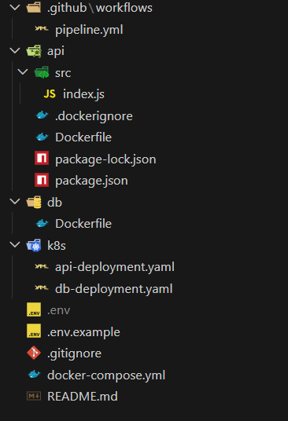

2. ### docker compose up --build (API + DB up)
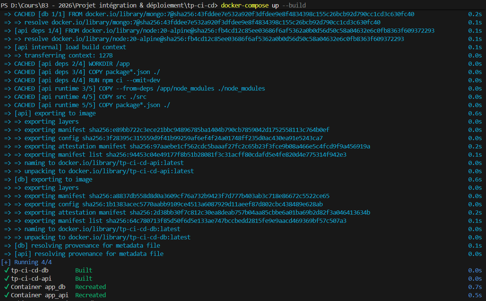

3. ### docker container up
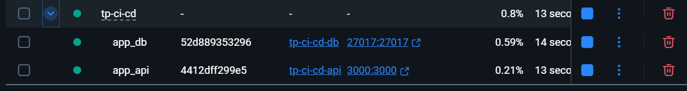

4. ### curl /health local
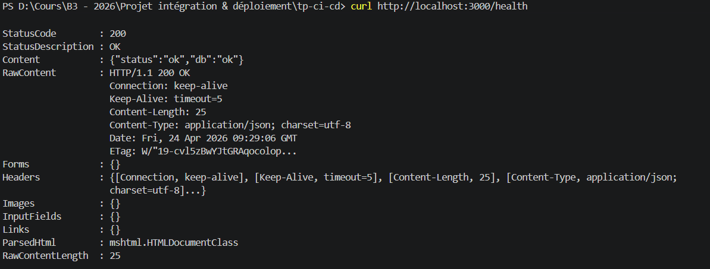

5. ### POST puis GET /users local
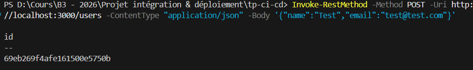  
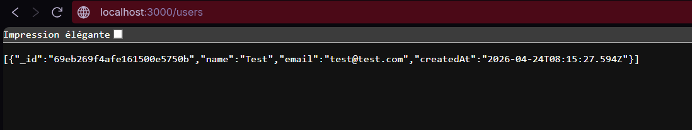

6. ### Connexion à la VM Azure
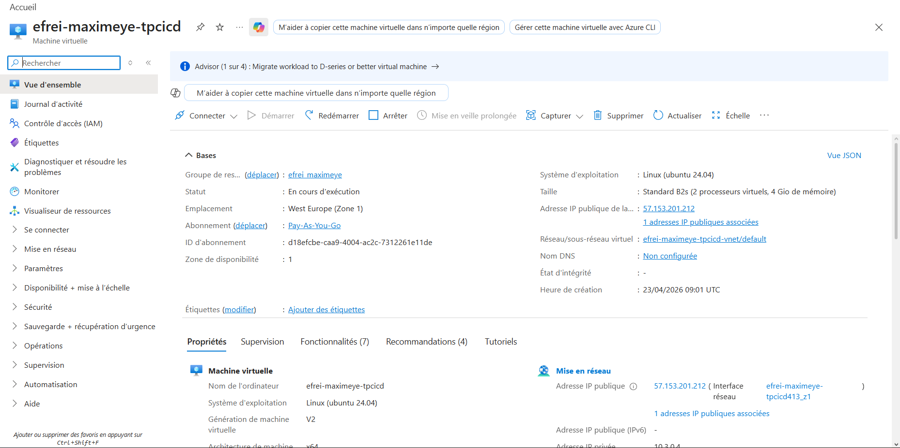  
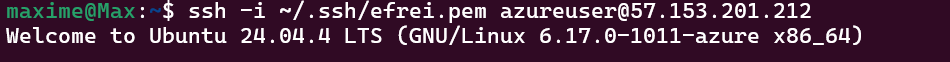

7. ### Install de Docker, Docker-compose & K8S
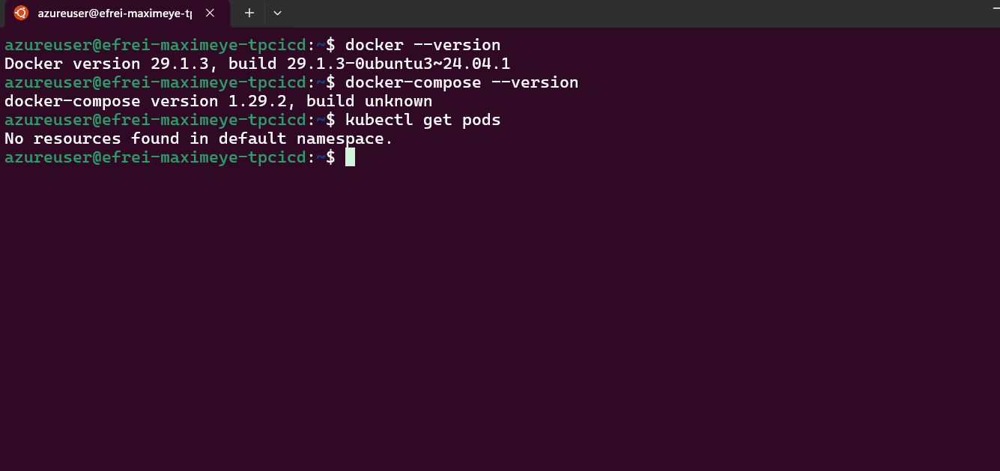  
Utilisation de version pour la vérification des install de docker, docker-compose et k8s  

8. ### kubectl get pods -n app
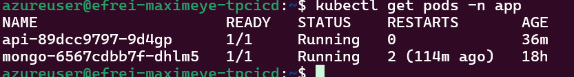
Vérifier si nos services sont bien up  

9. ### curl http://IP_VM:30080/ sur navigateur

  

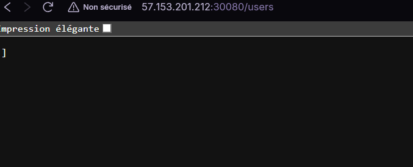  

En utilisant :  
```bash 
curl -X POST http://localhost:30080/users \
-H "Content-Type: application/json" \
-d '{"name":"testeur","email":"testeur@test.com"}'
```

On peut ajouter un utilisateur dans la DB.  

10. ### Secrets
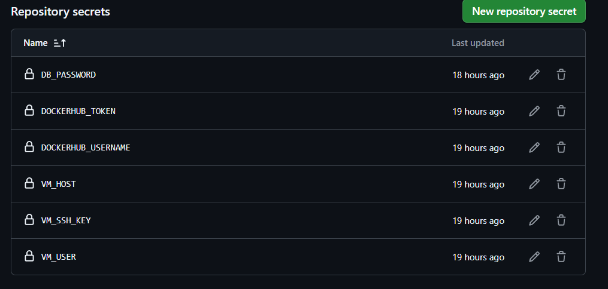

11. ### run GitHub Actions
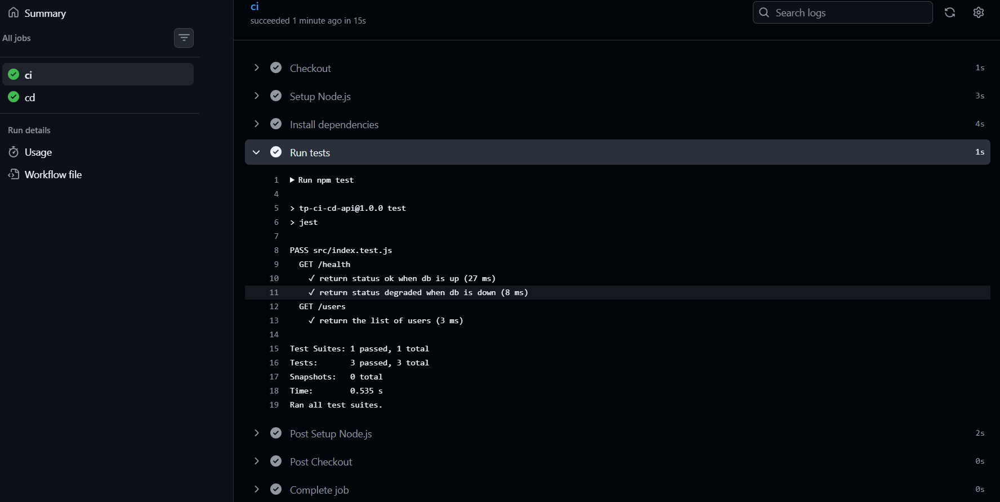  

Lancement de la pipeline à chaque push sur le dernier commit dans le repository github